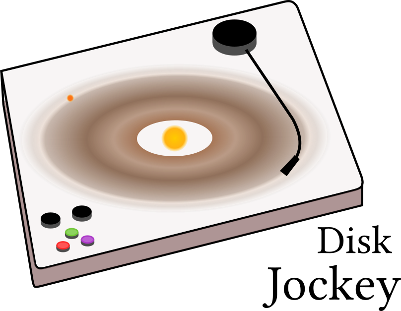

DiskJockey
===============

Copyright Ian Czekala and collaborators 2014-19

email: iancze@gmail.com

This package derives dynamical masses for T Tauri stars using the Keplerian motion of their circumstellar disks, applied to radio interferometric data from the Atacama Large Millimeter Array (ALMA) and the Submillimeter Array (SMA). **If you use this code or a derivative of it in your research, we would really appreciate it if you cited the first paper in our series, [Czekala et al. 2015 ApJ, 806 154C](http://adsabs.harvard.edu/abs/2015ApJ...806..154C).**

See an explanation of [how dynamical mass measurements](http://iancze.github.io/dynamical/) work.

Papers published using DiskJockey:

* *A Disk-based Dynamical Constraint on the Mass of the Young Binary AK Sco* : [Czekala et al. 2015 ApJ, 806 154C](http://adsabs.harvard.edu/abs/2015ApJ...806..154C)
* *A Disk-based Dynamical Constraint on the Mass of the Young Binary DQ Tau* : [Czekala et al. 2016 ApJ, 818 156C](http://adsabs.harvard.edu/abs/2016ApJ...818..156C)
* *ALMA Measurements of Circumstellar Material in the GQ Lup System* : [Macgregor et al. 2017, ApJ, 835, 17M](http://adsabs.harvard.edu/abs/2017ApJ...835...17M)
* *ALMA Observations of the Young Substellar Binary System 2M1207* : [Ricci et al. 2017 AJ, 154, 24R](http://adsabs.harvard.edu/abs/2017AJ....154...24R)
* *The Architecture of the GW Ori Young Triple Star System and Its Disk: Dynamical Masses, Mutual Inclinations, and Recurrent Eclipses* : [Czekala et al. 2017, ApJ, 851, 132](http://adsabs.harvard.edu/abs/2017arXiv171003153C)

We can also be found in the [astrophysics source code library](http://ascl.net/1603.011) as well.

For installation instructions and documentation, please see the [documentation](http://iancze.github.io/DiskJockey/latest/).

# Organization

DiskJockey is designed to forward model interferometric observations of protoplanetary disks, for the purpose of deriving a precise measurement of the central (sub-)stellar mass.

This package relies upon the excellent radiative synthesis package RADMC-3D to perform the radiative transfer of the disk model. Comprehensive documentation for RADMC-3D can be found [here](http://www.ita.uni-heidelberg.de/~dullemond/software/radmc-3d/). For package versions after v0.1.2, RADMC-3D is installed locally within the DiskJockey package. This means that you should be able to run all of the examples without needing to install RADMC-3D separately. If you already use RADMC-3D for other synthesis, this will leave your current installation alone, it's just that DiskJockey will use the version it installed for itself.

There are several stages to evaluating the best-fitting parameters of a disk structure model:

1. model specification
2. radiative synthesis
3. visibility interpolation
4. likelihood evaluation

I have organized the code in this package into source (in the `src` directory) and scripts (in the `scripts`) directory. After installation (see below), if you do

    using DiskJockey

You will be able to access any of the modules within `src`. These provide the base functionality for the package in common tasks, such as reading in images produced by RADMC-3D, Fourier transforms, and visibility interpolation. My hope is to make these components as general as possible so if you would like to extend this package to fit a novel type of disk, it will be easy to reuse many of the core functionality.

The scripts are not technically part of the Julia package (you cannot import them like the modules) but instead provide "driver scripts" that utilize the core modules to address a certain research question. For example, `DJ_initialize.jl` writes input files to disk, and `DJ_synthesize_model.jl` synthesizes a model using RADMC-3D. These are run from your system shell after adding them to your `PATH`

    $ DJ_initialize.jl && DJ_synthesize_model.jl

## Computational demand

Because spectral line datasets are large, and synthesizing models is computationally expensive, I have designed this package to work in a parallel environment. Therefore, please keep this architecture in mind when navigating the source code. Due to the computationally expensive nature of the radiative synthesis, fitting sizable datasets (e.g., SMA and ALMA) will **require a substantial amount of CPU cores to explore a posterior distribution in a reasonable timeframe**. For example, to fully explore the posterior for the AK Sco example dataset (to a density comparable to the plots in the ApJ paper) will require a **few days** of computing time on ~32 cores or more.
