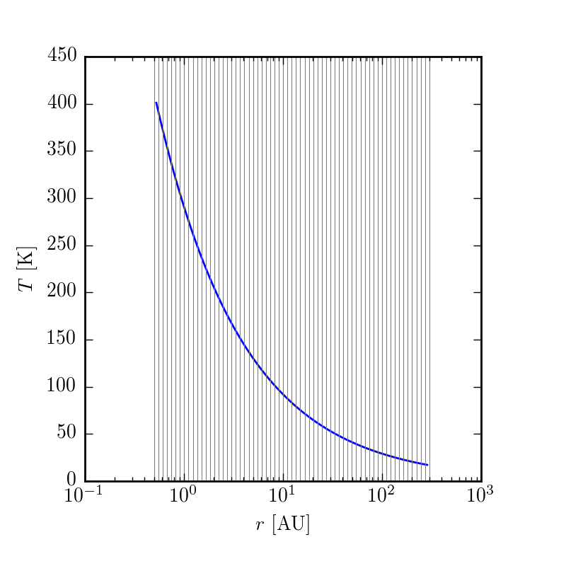
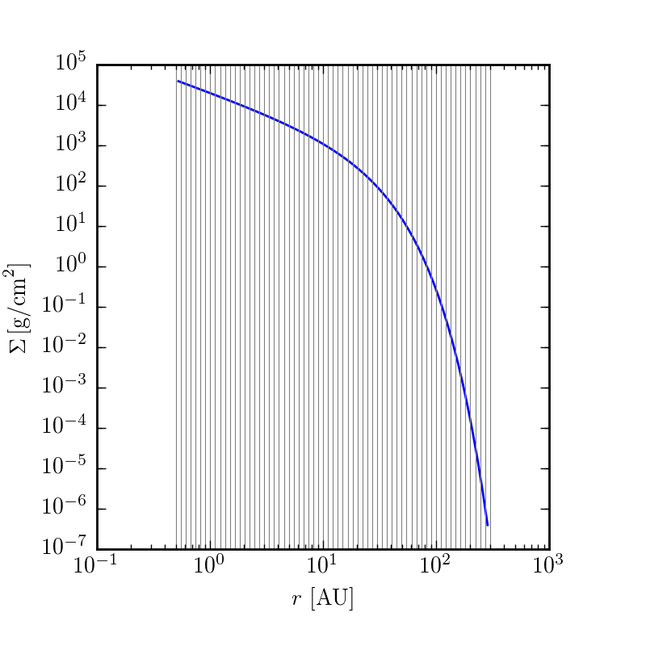
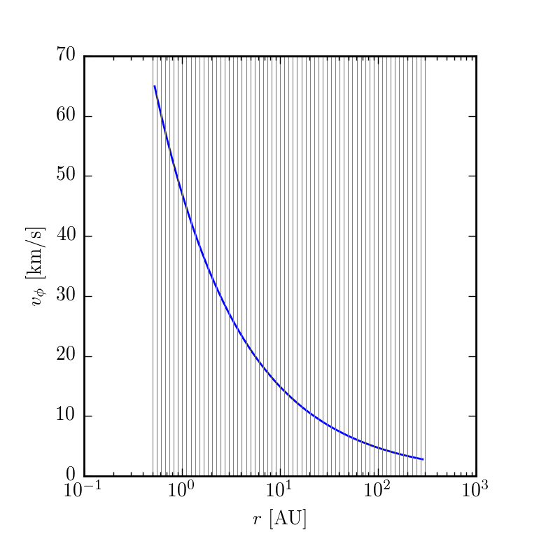
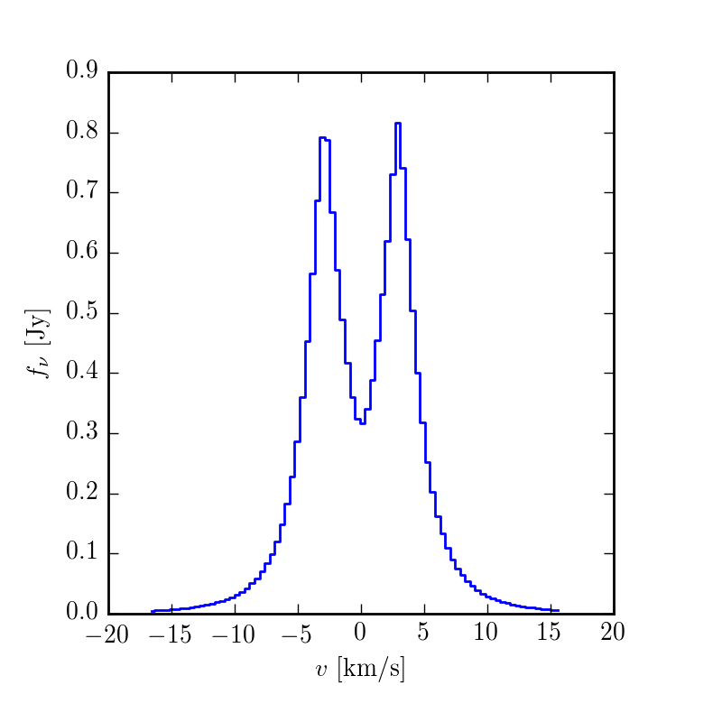

# Cookbook

After you have installed `DiskJockey`, it's time to get up and running!

## Initialization

Now the `DiskJockey` package should be successfully installed user-wide. Because it is likely that you will want to fit more than just one protoplanetary disk, or perhaps try different model specifications for a particular disk, the code structure is organized so that you will have a separate directory for each disk model. The following is an example to get you started fitting AK Sco.

    $ mkdir AKSco
    $ cd AKSco

Make sure to download the dataset in HDF5 format [here](https://figshare.com/articles/ALMA_AK_Sco_12CO_J_2_1_Visibilities/2066022).

Now, you'll want to initialize this directory with a config file. This config file will store all of the options that are specific to fitting this disk and is frequently used by many of the scripts in this package. To initialize,

    $ DJ_Initialize.jl --new-project=standard
    Copied default config.yaml, InitializeWalkers.ipynb, and Makefile for the standard model to current working directory.
    Exiting

`--new-project` also has other than `standard`, such as `cavity` and `vertical` in order to fit more exotic models. Now, open up `config.yaml` with your favorite text editor and change the fields as you see fit, including which transition of CO you would like to fit. Currently (v0.1.3), this package only includes functionality for 12CO, 13CO, and C18O in LTE. Please create an issue on the github repository if you would like a new species added.

To help get you started, here are some reasonable fields for the config.yaml file for AK Sco

General synthesis parameters

    name: AKSco
    gas: true
    species : 12CO # Possible choices: 12CO, 13CO, C18O. Future may include HCN, etc...
    transition: 2-1 # J =

The model grid setup

    grid:
      nr: 128
      ntheta: 40 # if mirrored about the equator, total of 64
      nphi: 1
      r_in: 0.1 # [AU] # Inner edge of model grid
      r_out: 300. # [AU] # Outer edge of model grid

The distance parameters. For now, we will keep distance fixed.

    fix_d : true

Choose what type of model will we be fitting.

    model : standard # choices of {standard, truncated, vertical, cavity, etc..}

Now comes parameters that can be used to synthesize and plot models. Due to a quirk of how YAML files are read, make sure that each of these parameter values is a float and not an int (i.e., `1.0` vs. `1`).

    parameters:
      M_star: 2.49 # [M_sun] stellar mass
      r_c: 14.00 # [AU] characteristic radius
      T_10: 91.85 # [K] temperature at 10 AU
      q: 0.51 # temperature gradient exponent
      gamma: 1.0 # surface density gradient
      logM_gas: -3.42 # [M_Sun] disk mass of gas
      ksi: 0.31 # [km/s] microturbulence
      dpc: 142. # [pc] distance
      incl: 109.4 # [degrees] inclination
      PA: 141.1 # [degrees] position angle
      vel: -26.1 # [km/s]
      mu_RA: 0.053 # [arcsec] centroid location
      mu_DEC: 0.045 # [arcsec]

Of all of these parameters, it might be hardest to guess correctly at the systemic velocity of the source. Generally, this is best done in the data reduction stages, for example taking a quick look at the central frequency of the spectral line. Note that the AK Sco dataset is provided in the raw *topocentric* frame, so the velocity quoted here is not the same as the LSRK quoted in the paper.

Now, we need to specify how big we want our image to be and how many pixels it should have.

    # Image setup
    size_arcsec : 12.0 # [arcsec] full width/height of image
    npix: 512

The final section is parameters that roughly describe the RMS in the observation and the approximate beam size. These parameters are only used in the channel map plotting script to help make the channel maps look more comparable to the observation, and you don't need to worry about them now.

    beam :
      rms : 0.01 # Jy/beam
      BMAJ: 0.9 # arcsec # Major axis of ellipse
      BMIN: 0.9 # arcsec # Minor axis of ellipse
      BPA: 1.0 # degrees east of North of the semi-major axis.

Now, a good thing to check is that our setup parameters actually satisfy the Nyquist theorem. There is a helper script for this

    $ max_baseline.jl  
    Dataset channels are velocities from -10.517295788189767 to -42.656605289812504 and span -32.13930950162273 km/s.
    Midpoint is -26.586950539001137 km/s.
    Max baseline 338.5121039138373 kilolambda
    Nyquist sampling satisfied. dRA: 0.0234375 [arcsec/pix] ; dRA_max: 0.2769671424693894 [arcsec/pix]
    Image size satisfied. Image size at the closest distances: 510.0 [AU]; outer radius of the grid + 10%: 330.0 [AU]

It looks like everything is OK to start!

## Makefile

New in v0.1.3, I've written a Makefile which should simplify a lot of the necessary tasks within the directory for a sigle object. You can generally do everything you need to via `make <target>`, where the various targets will now be described.

## Plotting up the model structure

To get a first pass glimpse at what the model will look like, you can make plots of the key quantities as a function of disk position.

    $ make structure

will create plots in your current working directory of velocity, temperature, and surface density. If want to play around with this, change a parameter in `config.yaml` and then rerun `make structure`

## Synthesizing a model image

Before jumping into running any MCMC chains, it is a good idea to take a guess at some parameters and try synthesizing a set of model channel maps to see if your model looks remotely close to the dataset. Then, you can play around with values in `config.yaml` to see what works well.

To jump right in, just try

    $ make chmaps

And the code will start synthesizing channel maps. Because the AK Sco contains a lot of channels, this may take about 5 minutes to get everything done. During this process, the output from RADMC-3D is piped to `STDOUT`. This may be a good place to debug if anything looks fishy.

When complete, this should leave you with several `chmaps_*.png` files in your current directory. Take a look and see if these appear reasonable.

For me, a typical workflow for playing around with channel maps is

1. edit `config.yaml` to parameters that might make sense
2. run `make structure` to see that the disk properties look reasonable
2. run `make chmaps` to actually synthesize images
3. inspect the resulting plots of the data (`chmaps_linear.png`), and if I am not satisfied go back to 1

It is a very good idea to inspect your channel maps to make sure that there isn't any weird structure, that you have enough pixels to resolve the disk structure, and that your model grid appears to be at high enough resolution. **A few extra minutes or hours spent debugging your images during this step can save you days (of supercomputer time) in the steps ahead.**

If you'd like to make a spatially-integrated spectrum, you can also do

    $ make spectrum.png

## Setting up a parallelized MCMC exploration of the parameters

As you just experienced, model synthesis can take a very long time, generally 1 - 5 minutes per model in the case of AK Sco. In order to explore the posterior in a reasonable amount of time, we need to parallelize the synthesis and evaluation of the likelihood function across multiple compute cores. This is done using a Julia port of the Ensemble Sampler by Goodman and Weare 2010, implemented in Python by Foreman-Mackey et al. as `emcee`. For more information about this great sampler, see [here](http://dan.iel.fm/emcee/current/).

Much like `emcee`, starting out requires deciding upon the positions of the walkers. To aid in placing these, the `DJ_initialize.jl` script copied over a Jupyter/Python notebook to your current directory. Now, open up `InitilializeWalkers.ipynb` with a Jupyter notebook. We will change these following values to correspond to your disk of choice.

To save you some computational time otherwise spent on burn-in, I found that the following walker starting positions worked well for AK Sco

    p0 = np.array([np.random.uniform(2.4, 2.5, nwalkers), # mass [M_sun]
              np.random.uniform(14., 15.0, nwalkers), #r_c [AU]
              np.random.uniform(92., 93., nwalkers), #T_10 [K]
              np.random.uniform(0.51, 0.55, nwalkers), # q
              np.random.uniform(-3.5, -3.4, nwalkers), #log10 M_gas [log10 M_sun]
              np.random.uniform(0.3, 0.32, nwalkers), #xi [km/s]
              np.random.uniform(140.0, 144.0, nwalkers), #dpc [pc]
              np.random.uniform(110.0, 112.0, nwalkers), #inc [degrees]
              np.random.uniform(140.0, 141.0, nwalkers), #PA [degrees]
              np.random.uniform(-26.1, -26.0, nwalkers), #vz [km/s]
              np.random.uniform(0.0, 0.05, nwalkers), #mu_a [arcsec]
              np.random.uniform(0.0, 0.4, nwalkers)]) #mu_d [arcsec]

Then finish evaluating the rest of the cells so that you save the file `pos0.npy` into your current working directory.

How many walkers should I use? Due the the way the Ensemble Sampler advances, you can only evaluate half of the walkers simultaneously. That means that if you are running with more cores than `nwalkers/2`, you will have several cores idle throughout the sampling. Of course, you could now increase the number of walkers to be `2 * ncores`.

## Launching the run

The exploration of the posterior is done via the `scripts/venus.jl` script. It is worth exploring this piece of code to see the various moving parts. How you invoke this script depends on your cluster environment. For a dataset the size of AK Sco, it's not worth your time to start run this script (except for debugging purposes) unless you have access to 20 or more cores.

### Local machine with 20 cores

If you have your own 20-core machine, you can launch the script via  

    $ venus.jl -p 19

Much like the Julia interpreter itself, the `-p` argument will add an addition 19 workers to the master process for a total of 20 workers.

### High Performance Cluster

These Julia scripts can take advantage many possible cores spread across multiple nodes. This may require some custom script writing for your specific cluster situation, but the main ideas are as follows

1. write a submission script that specifies total number of cores, time, memory, etc
2. upon submission, determine how many cores you have been allocated on which nodes
3. create a hosts.txt file which contains this information, following the Julia spec here.
4. then start your job with

    julia --machinefile hosts.txt venus.jl

## Examining the output

Because the MCMC run is so expensive, the code is designed to periodically write out snapshots of the samples, to both save your progress and allow you to check up on the chains mid-run. You can set the cadence in the `config.yaml` file under

    # MCMC setup
    samples: 10
    loops: 1

Basically, in each `loop`, the code advances `N` `samples`. After each loop, the full chain (`chain.npy`) is written to the `output/` directory along with a current snapshot of the walker positions, `pos0.npy`. This way if your `venus.jl` script ends (either by design or cluster failure), you can copy this `pos0.npy` back to your project directory and start from the last known walker positions.

At this point you can take the samples in `chain.npy` and analyze them as you would normal MCMC samples. To save you the trouble, however, we included a script to help with these tasks

    $ plot_walkers.py

will plot the walker positions as a function of iteration (`walkers.png`). Examining `walkers.png` is a decent way to estimate if your chains are done with burn-in.

When you are ready, you can burn off these first say 300 (or more) iterations and make a corner plot (`triangle.png`) by

    $ plot_walkers.py --burn 300 --tri
